# Isometric Tiled 2 Unity User Guid

[TOC]

## About ITU

 ITU(Isometric Tiled 2 Unity) is the tool for analyze Tiled map and export it to Unity. 
 
**it only focus on isometric base tile.** 
 
 i'm not plan to wrote a All-In-One tool inside of that ,  i try to make ITU process flow more separately more independently. 
 
 so that it's can be more easily to modify or use each part with extension via script.
 
## Version

### 1.0.1
- add : support for Tilest "Collection of image" type (not export anything , need use extension to handle the custom property)
- optimize : not generate tileset material if it never been used.

### 1.0.0

- init version
 
### Contact
 
via e-mail: iamzealotwang@126.com 
language : 中文 or English

### Features

- Isometric , Isometric Staggered , Infinite  Map support

- Custom properties support.
- Custom Shader support.
- Custom render chunk size support , extremely useful for huge map.
- Custom tile size (not 2:1 eg 256x128,128x64) support
- Low level API , easy to merge with existing workflow.
- Full source code access and easy to modify.

### Limitation

- ITU(Isometric Tiled 2 Unity) only work for isometric base tile, **NOT working for orthogonal or hexagonal tile.**

- Tiled map file(.tmx) should use CSV as layer format

- Each tileset(.tsx) can only have one image (.png) as it source file

- Not directly support for Animate tile or 2D/3D collider, but it can be made by use extension, see more info on Advance Usage chapter

---

## Quick Start

ITU provide a simple but useful GUI tool. you can try it first 

if it's not fit for your scenario. 

i suggest you take a look at Advance Usage chapter and write your own one.

### Step1 Set default sorting layer

ITU will draw all mesh with mesh render on one or more sorting layer .

the GUI part only draw all Tiled layer on one Unity sorting layer .

but if you need draw each layer separately . you can modify it in render setting via script (see more on Advance Usage).

it need to define each sorting layer first before any rendering start.

Edit -> Project Settings -> Tags and Layers

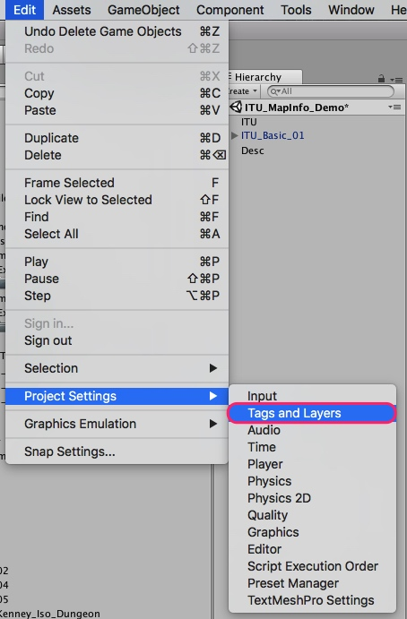


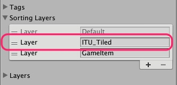

ITU will use `ITU_Tiled` by default, you can add `ITU_Tiled` or any name you liked in it.


### Step2 Open ITU GUI and choice Tiled map

ITU GUI tool can be opened via Tools -> IsometricTiled2Unity -> Import Txm


click the open button , choice a Tiled map file to open

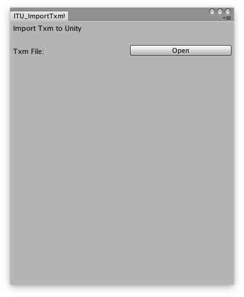

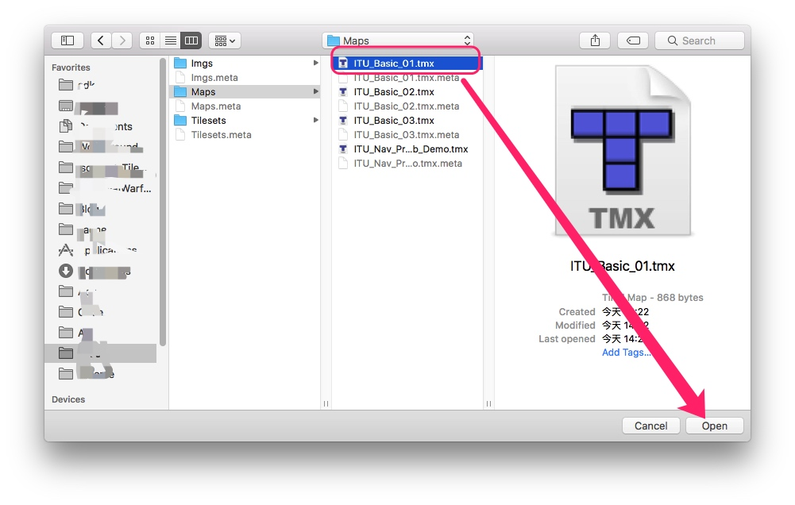

you can put the Raw file (.tmx, .tsx .png) in any folder you liked , but i suggest to put those file **outside** Unity project folder , because ITU will duplicate those file and copy it under `ITU_Porject` folder .


click `Choice` button to choice a folder as the `ITU_Project` folder.

when ITU process finish , it will generate some sub folder.

> `$ITU_Project_Folder/Maps/$Tiled_Name/Meshes` : store all mesh for map $Tiled_Name

> `$ITU_Project_Folder/Maps/$Tiled_Name/Prefab` : the map prefab

> `$ITU_Project_Folder/Tilesets/Imgs` : tileset source image

> `$ITU_Project_Folder/Tilesets/Materials` : material use for the same name tileset


### Step3 Play with render setting

after chose Tiled map file and ITU_Project folder ,there will show up some render setting let you play with.

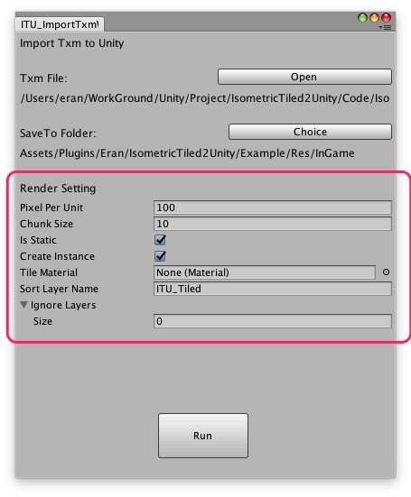


#### Pixel Pre Unit

same as Unity pixel pre unit , default is 100

#### Chunk Size

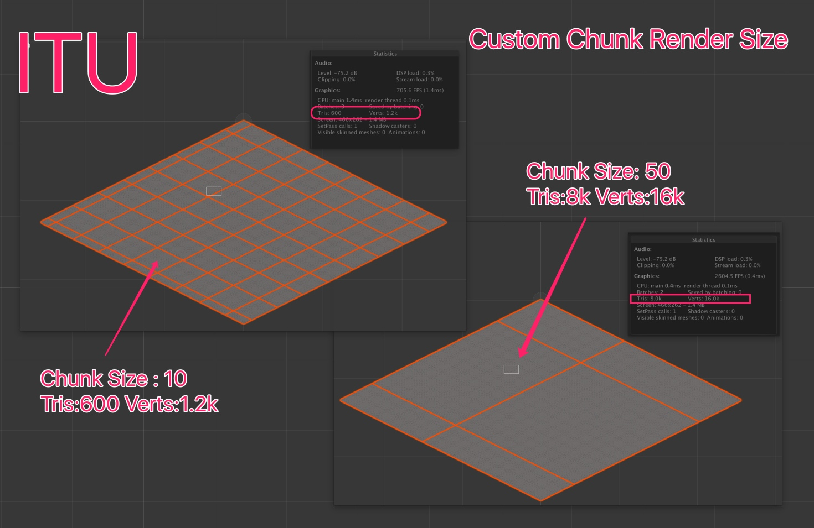

chunk render size define how many tile will combine to one mesh. eg chunk size=10 , it means 10(width) x 10(height) = 100 tile will combine together as one mesh.

Unity automatically culling mesh outside camera. so control the chunk size is the key to gain good performance on huge map.

but be aware , it't not mean use small chunk size is good, it will generate more GameObject when chunk size is too small , and it will also cause performance issue.


#### IsStatic

if IsStatic = true , it will mark the entire TileMap static, except navigation. because if mark the gameObject navigation static ,it will effected navMesh generate.

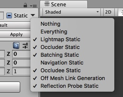


#### Create Instance

ITU will create a tilemap prefab at Path `$ITU_Project_Folder/Maps/$Tiled_Name/Prefab`

if CreateInstance = true then , when ITU render complete , it will create a instance of this prefab on current scene. 

#### TileMaterial

define the material for each tileset, if leave this property to `null`, then IUT will use `Unlit/Transparent` as default.


it is possible to assign different material for each tileset via script, see more info on Advance Usage chapter

#### SortLayerName

define the sorting layer , it is possible to assign different sorting layer for each Tiled layer via script, see more info on `Advance Usage` part

#### IgnoreLayers

define which Tiled layer you don't want ITU to render


eg, there have three layer (Sky,Building,Ground) defined in Tiled map , and you set Building to ignore layers , then ITU will only render Sky and Ground.

### Run

just click the button , and ITU will do the rest for you.


---

## Advance Usage

### Run ITU via script

you can create a [CustomeEditor](https://docs.unity3d.com/Manual/editor-CustomEditors.html), [EditorWindow](https://docs.unity3d.com/ScriptReference/EditorWindow.html) , [MenuItem](https://docs.unity3d.com/ScriptReference/MenuItem.html) or whatever way you want to run ITU via script.

here is a demo on how to run ITU with code.

```csharp

public string txmFilePath = "/Plugins/Eran/IsometricTiled2Unity/Example/Res/Raw/Tiled/Maps/ITU_Nav_Prefab_Demo.tmx";
public string saveProjectToPath = "/Plugins/Eran/IsometricTiled2Unity/Example/Res/InGame";
    
var itu = new ITU_Facade();

//Load Txm map
itu.LoadTxmFile(Application.dataPath + txmFilePath);

//Attach extension
var ext1 = new YourCustomExtension1();
var ext2 = new YourCustomExtension1();
itu.AddExtensions(ext1);
itu.AddExtensions(ext2);

//Render
var rednerSetting = new ITU_RenderSetting();   
rednerSetting.SetSaveToFolder(saveProjectToPath, Path.GetFileNameWithoutExtension(txmFilePath));
     
itu.SetRenderSetting(rednerSetting);
itu.RenderMapToCurrentScene();

//Handle Object & Property
itu.HandleMapPropertyAndObject();

```

there have four step for the all process.

#### Step1 : Prepare

##### TmxFilePath

this is the full path of the Tild map file you want to process. if the file under Unity project folder , you can use  `Application.dataPath+$relateFilePath` to get full Path. 
if the file is outside the project folder , you can define it by const string , or use [EditorUtility.OpenFilePanel](https://docs.unity3d.com/ScriptReference/EditorUtility.OpenFilePanel.html) to select it manually.

##### ITU_Project_Folder

```
var rednerSetting = new ITU_RenderSetting();   
rednerSetting.SetSaveToFolder(path,txmFileName);
```

in renderSetting ,you can use function `SetSaveToFolder` to define all saveToPath,

the result would be same as the GUI Windows


```
//ITU_RenderSetting.cs
public void SetSaveToFolder(string _path, string _txmFileName)
{
    meshSaveToPath = _path + "/Maps/" + _txmFileName + "/Meshes";
    prefabSaveToPath = _path + "/Maps/" + _txmFileName + "/Prefab";
    imgSaveToPath = _path + "/Tilesets/Imgs";
    materailSaveToPath = _path + "/Tilesets/Materials";
}
```

if you prefer to handle it in you own way , you can also set those saveToPath separately

```csharp
var rednerSetting = new ITU_RenderSetting(); 
rednerSetting.meshSaveToPath="xxx";
rednerSetting.prefabSaveToPath="xxx";
rednerSetting.imgSaveToPath="xxx";
rednerSetting.materailSaveToPath="xxx";
```

be aware that 

- all saveToPath is relate to Unity project folder

- ITU will **Delete** all mesh file under `rednerSetting.meshSaveToPath` when it start.

##### RenderSetting

most of the render setting property are expose in GUI part, but some of them can only access via script. you can check `ITU_RenderSetting.cs` file to see more details.

###### Custom Shader

`tilesetMaterials` is use to define custom material for each tileset. 

for example you have a animate tile for render water layer (AnimateWaterTileset.tsx)

and you already wrote a shader(AnimateTileShader) to handle that.

then you can add this to `tilesetMaterials`.

```
rednerSetting.tilesetMaterials.Add("AnimateWaterTileset",new Material(Shader.Find("AnimateTileShader")))

```

IUT default use `Unlit/Transparent` for tileset render , if you want change that , you can replace it with other by set `defaultMaterial`

```
rednerSetting.defaultMaterial = new Material(Shader.Find("YourShader"));
```


###### Custom SortingLayer

sometimes you don't want all Tiled layer rendered in one single sorting layer .

e.g you defined three layer in Tiled(Top,Middle,Bottom) and you want use three Unity sorting layer to handle it.

first you need define those sorting layer in `Edit->ProjectSetting->Tag&Layer`

(IUT_Top,IUT_Middle,IUT_Bottom)

then you can set those via code:

```
rednerSetting.customSortLayerDic.Add("Top","IUT_Top");
rednerSetting.customSortLayerDic.Add("Middle","IUT_Middle");
rednerSetting.customSortLayerDic.Add("Bottom","IUT_Bottom");
```

also if ITU can't find any Tiled layer defined in `customSortLayerDic` then it will draw that layer to `defaultSortLayerName` ,

the default named is `ITU_Tiled` , you can change it by

```
rednerSetting.defaultSortLayerName="xxx";
```


#### Step2 : Load and Deserialize

when prepare is done , you can call 

```
var mapMeta = itu.LoadTxmFile($txmFilePath);
```

to load the Tiled map file.

ITU is not only deserialize the Tiled map file(.txm) and Tild tileset file(.tsx)  but also did some link and calculate stuff

eg, you can:
- access each tile uv info by `ITU_TsxEachTileMeta.cs`
- access each tileset image full path by `ITU_TsxRootMeta.cs`
...

normally you don't need pay attention on this part , but in some peculiar case , you may ignore render and handle object & property part, and just use the raw meta file  directly. 

in that case i would suggest you set a break point after `itu.LoadTxmFile()` and see what ITU already done , and take it from there.

#### Step3 : Render

after the render setting is set , you can call 

```
itu.RenderMapToCurrentScene();
```

to start the render process . 

you may use extension to engage the render process , see more info on `Working with extension` part.

and the render process is not necessary part, sometimes you may just want use Tiled as a level editor ,export level data to a json file, no render required. 

in that case,you can just ignore those part , and jump to `Object & Property` handle part.

#### Step4 : Handle Object & Property

call 

```csharp
itu.HandleMapPropertyAndObject();
```
will start the process ,**but object & property handle only work with extension**, so if you not set any extension to ITU before running this process , nothing will happen.

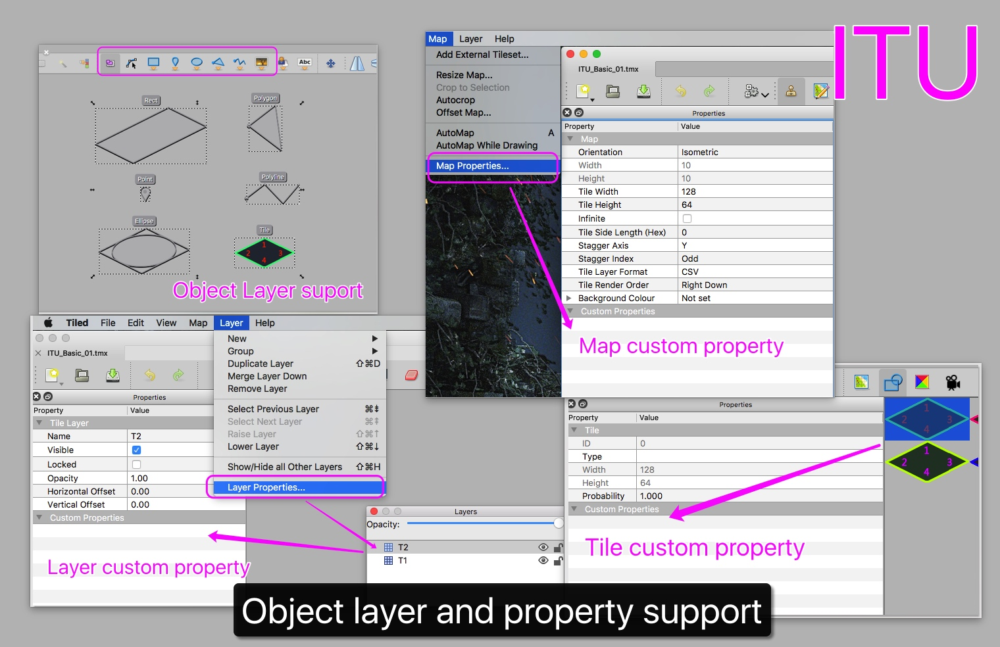


### Working with extension

extension is the best way to engage with ITU . create a C# Class, and extends `ITU_ExtensionBase` class , then use 

```
var ext1 = new YourCustomExtension1();
itu.AddExtensions(ext1);

```
add to ITU before it start any process.

extension have several virtual function you could override


**Render part:**

```
public virtual void OnRenderMapProcessBegin(){}

public virtual void OnRenderMapProcessFinish(GameObject _mapGameObject){}
    
public virtual void OnRenderTile(Vector2Int _tileIndex, Vector2 _tileTopCenterScenePos, float _tileWidthInUnit, float _tileHeightInUnit, ITU_TmxLayerMeta _layerMeta, ITU_TsxEachTileMeta _tileMeta){}
  
```

`OnRenderMapProcessBegin` will call before render process begin.

`OnRenderMapProcessFinish` will call when the render process finish

> `_mapGameObject` :  the render process result.

`OnRenderTile` will call when ITU process tile.

> `_tileIndex` : tile index in Tiled
> `_tileTopCenterScenePos`: tile position in current scene (x-y plane)

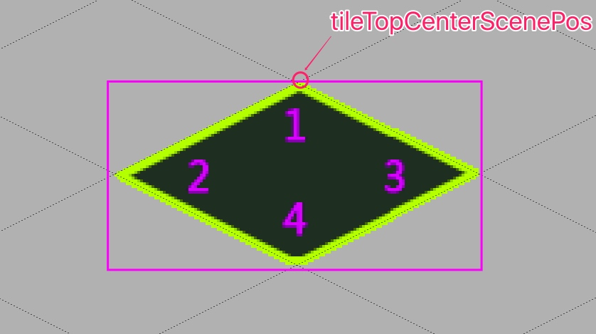

> `_tileWidthInUnit` & `_tileHeightInUnit` : unit size of each tile
> `_layerMeta` : current layer meta file
> `_tileMeta` current render tile meta file

Property & Object part:

```
public virtual void HandleMapPropertyAndObjectBegin(){}

public virtual void HandleMapPropertyAndObjectFinish(){}

public virtual void HandleMapProperty(ITU_PropertieRootMeta _mapProperty){}

public virtual void HandleLayerProperty(ITU_TmxLayerMeta _layerMeta, ITU_PropertieRootMeta _layerProperty){}

public virtual void HandleMapObject(ITU_EachObjectMeta _objectMeta){}

public virtual void HandelTileWithProperty(Vector2Int _tileIndex, Vector2 _tileTopCenterScenePos,float _tileWidthInUnit, float _tileHeightInUnit,
ITU_TmxLayerMeta _layerMeta,
ITU_TsxEachTileMeta _tileMeta){}
``` 

same as render part , but those function will only be called when you set property to it. 

e.g if you not set any map property , then `HandleMapProperty`will not be called.

#### Example

to help you quick understand how does extension work , i wrote two simple example

##### Generate map info with extension

in this example i will try to calculate the map basic info and use that info init a monobehavior class ,then attach it to the map gameobject.

you can watch this [video](https://youtu.be/qMHvjy4crjU)(https://youtu.be/qMHvjy4crjU) or open the scene in 

`/Plugins/Eran/IsometriceTiled2Unity/Example/Demos/ITU_MapInfo`

to see more info.


```
 public class ITU_ReadTxmMapInfoExtension : ITU_ExtensionBase
    {
        private float minPosX = float.MaxValue;
        private float minPosY = float.MaxValue;

        private float maxPosX = float.MinValue;
        private float maxPosY = float.MinValue;

        public override void OnRenderTile(Vector2Int _tileIndex, Vector2 _tileTopCenterScenePos, float _tileWidthInUnit, float _tileHeightInUnit, ITU_TmxLayerMeta _layerMeta,
            ITU_TsxEachTileMeta _tileMeta)
        {
            var minX = _tileTopCenterScenePos.x - _tileWidthInUnit / 2f;
            var maxX = _tileTopCenterScenePos.x + _tileWidthInUnit / 2f;
            var maxY = _tileTopCenterScenePos.y;
            var minY = _tileTopCenterScenePos.y - _tileHeightInUnit;
            minPosX = Mathf.Min(minPosX, minX);
            minPosY = Mathf.Min(minPosY, minY);
            maxPosX = Mathf.Max(maxPosX, maxX);
            maxPosY = Mathf.Max(maxPosY, maxY);
        }


        public override void OnRenderMapProcessFinish(GameObject _mapGameObject)
        {
            var sp = _mapGameObject.AddComponent<TxmMapInfo>();
            sp.mapFileName = mMapMeta.fileName;
            sp.mapWidthInUnit = Mathf.Abs(maxPosX - minPosX);
            sp.mapHeightInUnit = Mathf.Abs(maxPosY - minPosY);
            sp.isStaggered = mMapMeta.IsIsoStaggered();
            sp.mapLeftTopPosV2 = new Vector2(minPosX, maxPosY);
            sp.mapRightBottomPosV2 = new Vector2(maxPosX, minPosY);
        }
    }
```

on each time `OnRenderTile` called, the extension will compare the min/max value . 

and when all render process finish , ITU will call `OnRenderMapProcessFinish`, in this function you can attach all calculated info back to the map gameObject. 


##### Replace layer with Prefab and generate NavMesh

in this example i will try to replace one layer tile with Prefab ,and generate navMesh for the map.

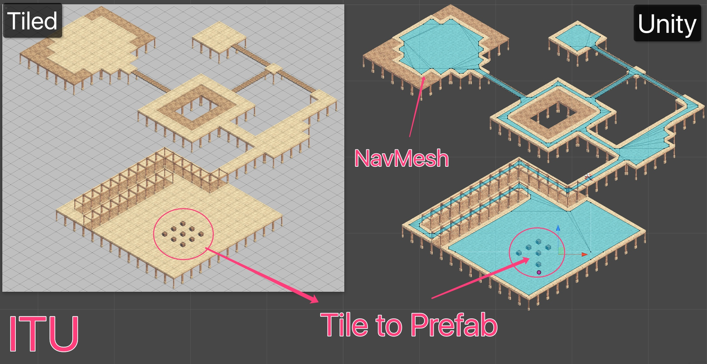


to achieve this goal, i need use two extension , one work for tile to prefab logic , the other work for generate navmesh

you can watch this [video](https://youtu.be/sUwdwxEQlYs)(https://youtu.be/sUwdwxEQlYs) or open the scene in 

`/Plugins/Eran/IsometriceTiled2Unity/Example/Demos/ITU_Nav_Prefab`

to see more info.


**Fix the sorting layer issue**

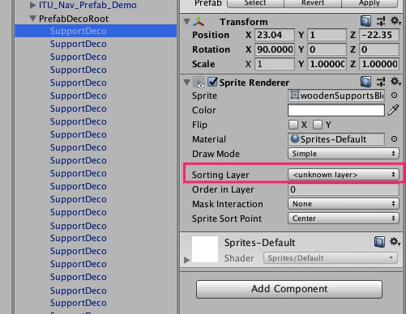

the demo scene `Demo_Nav_Prefab` put all prefab in a soring layer named `GameItem`.  but when you import this `unitypackage` to your own project , there won't be a sorting layer named as `GameItem`, so first we need to fix that issue.

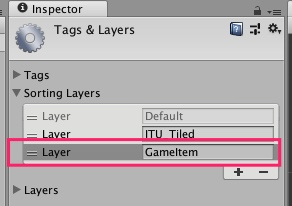

create a new sorting layer in Tag&Layers, make sure this sorting layer is under the ITU output layer, which default is `ITU_Tiled`.

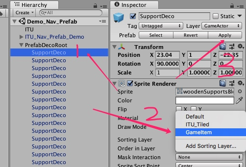
then assign the new layer to both `SupportDeco` & `BoxDeco` , click Apply button.


**Tile to Prefab**

in Tiled i defined three Layer : Deco Floor Ground

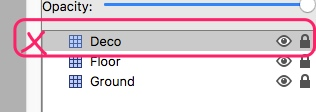


first i need tell ITU  that do not render `Deco` layer 

```
rednerSetting.ignoreRenderLayerNameList.Add("Deco");
```


then i need defined some custom property in tileset , so that extension can know which tile need to replace with prefab , and replace to which prefab.

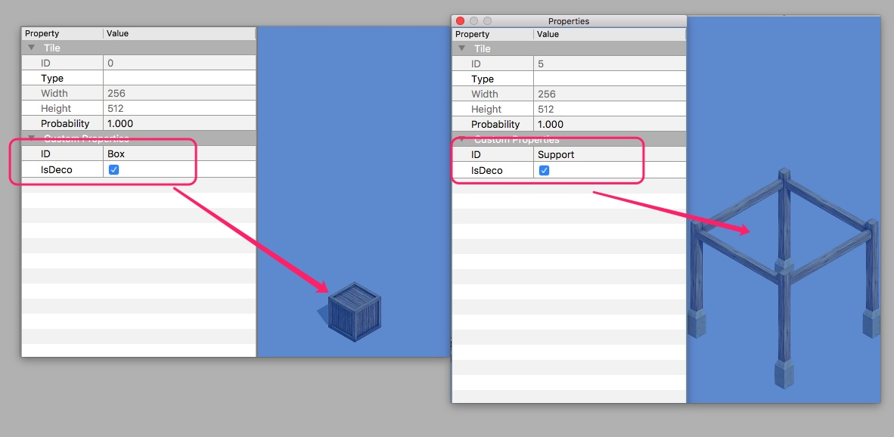


with everything setup completed, then can write the extension :

```
    public override void HandelTileWithProperty(Vector2Int _tileIndex, Vector2 _tileTopCenterScenePos, float _tileWidthInUnit, float _tileHeightInUnit, ITU_TmxLayerMeta _layerMeta,
        ITU_TsxEachTileMeta _tileMeta)
    {
        //Only replace tile in deco layer with prefab
        //the support deco is also used in Ground layer,and it will not replace.
        if (_layerMeta.layerName != "Deco") return;

        if (_tileMeta.property.HasProperty("IsDeco"))
        {
            var ID = _tileMeta.property.GetProperty("ID").value;
            var PrefabDeco = ID == "Box" ? PrefabBoxDeco : PrefabSupportDeco;
            var go = PrefabUtility.InstantiatePrefab(PrefabDeco) as GameObject;
            go.transform.parent = prefabDecoRoot.transform;
            go.transform.localEulerAngles = new Vector3(90, 0, 0);
            go.transform.position = new Vector3(_tileTopCenterScenePos.x, 1f, _tileTopCenterScenePos.y - +_tileHeightInUnit / 2f);
        }
    }
```

`_tileMeta.property.HasProperty("IsDeco")` can check is current tile have `IsDeco` key , but it's not check the `value` part. 

in this example no need to check the value part , because other tile do not contain  `IsDeco` key , but if you want with the value you can use 

```
_tileMeta.property.GetProperty("IsDeco").value=="true" 
```

to check the bool value.

in ITU, all the property value are store in string , but you can use 

```
property.GetProperty("xxx").type == ITU_EachPropertieMeta.TYPE_INT
```
to determine the property value type. see more info in class `ITU_EachPropertieMeta.cs`


**Generate NavMesh**

same as Tiled 2 Prefab part, first set the IsWalkable property

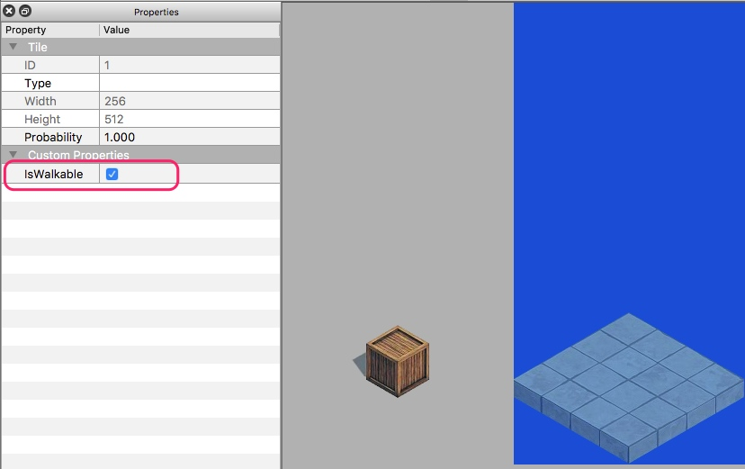

then the extension can use this property to generate a tile block, also set this block to `Navigation Static`.


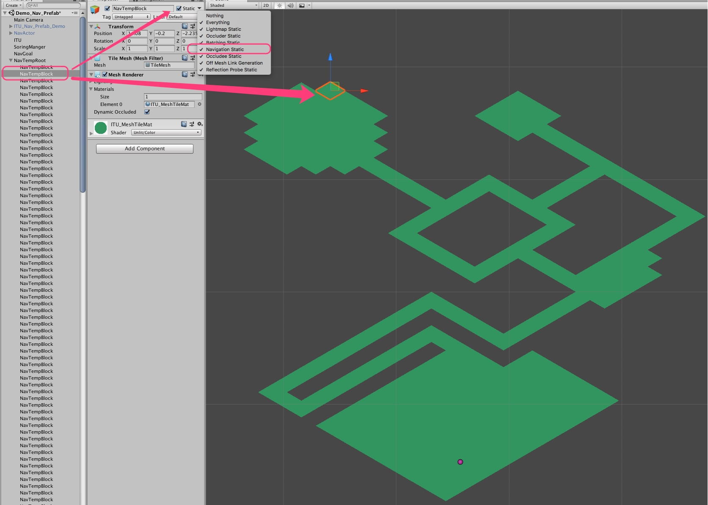

the rest of part is just standard Unity NavMesh process flow , adjust the baked agent size and bake the NavMesh.

